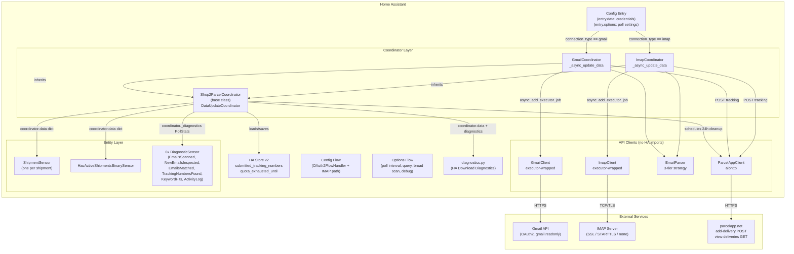
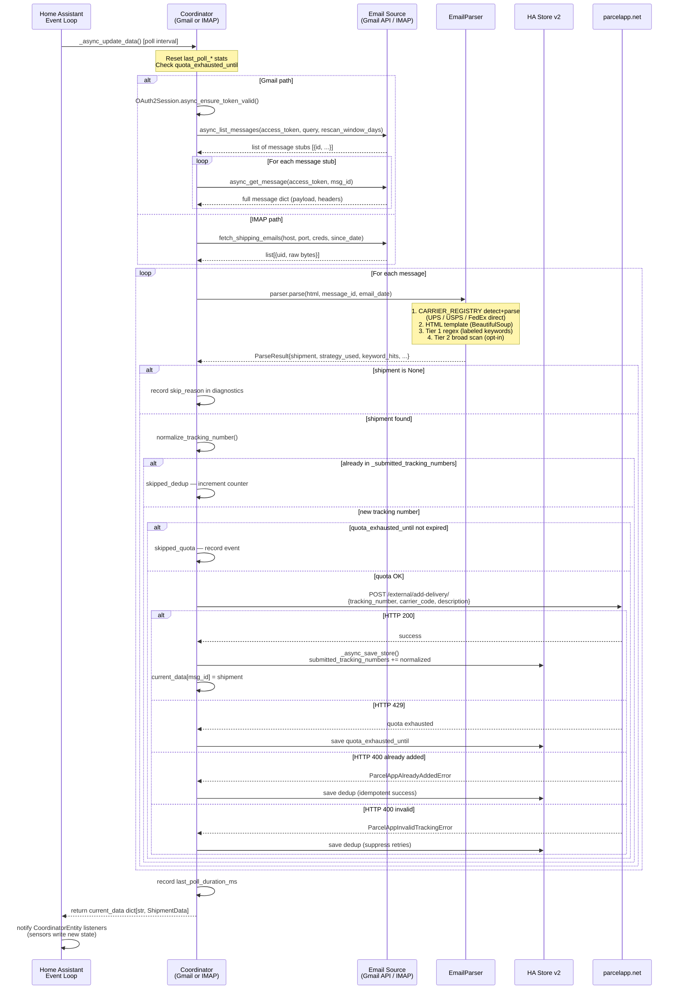
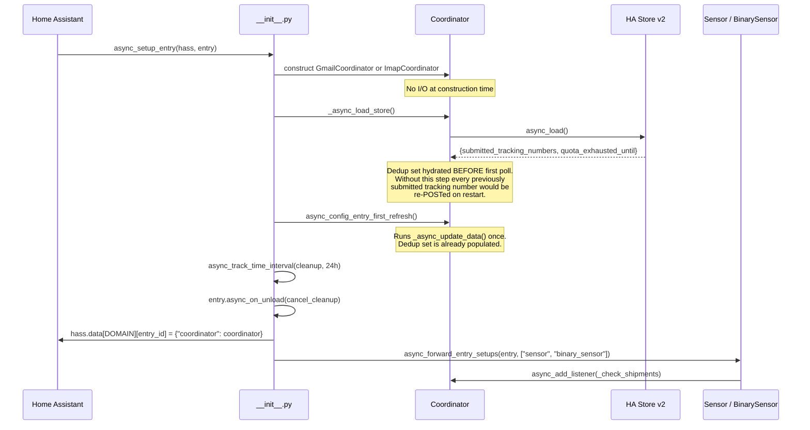
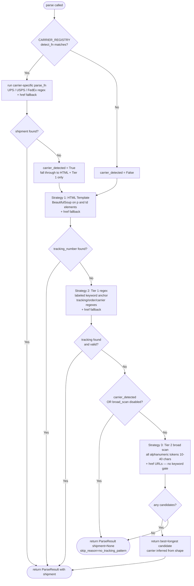

<!-- generated-by: gsd-doc-writer -->
# Shop2Parcel Architecture

## System Overview

Shop2Parcel is a Home Assistant custom integration (`iot_class: cloud_polling`) that monitors an email inbox — either Gmail via OAuth2 or any IMAP server — for Shopify shipping confirmation emails and direct carrier notification emails. On each poll cycle it extracts tracking numbers using a tiered HTML-parse / regex strategy, deduplicates against a persisted store, and forwards new shipments to the parcelapp.net external API. Shipments surface in Home Assistant as `sensor` entities; a companion `binary_sensor` signals whether any active shipments are present. Six diagnostic sensors expose per-poll counters and a scan-event activity log.

The integration follows the standard HA DataUpdateCoordinator pattern: a single coordinator owns all API I/O; all entities subscribe to coordinator updates and read from `coordinator.data` without performing their own I/O.

---

## System Architecture Diagram



---

## Data Flow: Poll Cycle

The following diagram shows the complete sequence for one poll execution from email fetch through parcelapp.net POST.



---

## Class and Component Hierarchy

```mermaid
classDiagram
    class DataUpdateCoordinator {
        <<HA Framework>>
        +async_config_entry_first_refresh()
        +async_add_listener()
        +async_set_updated_data()
        +data: dict[str, ShipmentData]
    }

    class Shop2ParcelCoordinator {
        +_store: Shop2ParcelStore
        +_submitted_tracking_numbers: OrderedDict
        +_quota_exhausted_until: int | None
        +_diagnostics: PollStats
        +_email_client: GmailClient | ImapClient
        +_async_load_store()
        +_async_save_store()
        +async_cleanup_delivered()
        +diagnostics: PollStats
    }

    class GmailCoordinator {
        +_email_client: GmailClient
        +_async_update_data() dict[str, ShipmentData]
    }

    class ImapCoordinator {
        +_email_client: ImapClient
        +_async_update_data() dict[str, ShipmentData]
    }

    class Shop2ParcelStore {
        <<HA Store subclass>>
        +version: int = 2
        +key: str = "shop2parcel.{entry_id}"
        +_async_migrate_func() v1→v2
    }

    class PollStats {
        <<dataclass, in-memory only>>
        +emails_returned_total: int
        +emails_scanned_total: int
        +emails_matched_total: int
        +tracking_numbers_found_total: int
        +keyword_hits_total: int
        +last_poll_*: various
        +scan_events: deque maxlen=50
        +scan_events_total: int
    }

    class GmailClient {
        +_executor: Callable
        +async_list_messages()
        +async_get_message()
        -_get_service()
    }

    class ImapClient {
        +_executor: Callable
        +fetch_shipping_emails()
        -_fetch_sync()
    }

    class EmailParser {
        +enable_broad_scan: bool
        +parse(html, message_id, email_date) ParseResult
        -_parse_html_template()
        -_parse_regex_tier1()
        -_parse_regex_tier2()
    }

    class CARRIER_REGISTRY {
        <<module-level list>>
        +(_detect_ups, _parse_ups)
        +(_detect_usps, _parse_usps)
        +(_detect_fedex, _parse_fedex)
    }

    class ParcelAppClient {
        +_session: aiohttp.ClientSession
        +_api_key: str
        +async_add_delivery()
        +async_get_deliveries()
    }

    class ShipmentData {
        <<dataclass, frozen>>
        +tracking_number: str
        +carrier_name: str
        +order_name: str
        +message_id: str
        +email_date: int
    }

    class ParseResult {
        <<dataclass, frozen>>
        +shipment: ShipmentData | None
        +skip_reason: str | None
        +strategy_used: str | None
        +keyword_hits: dict[str, bool]
        +candidate_tokens: list[str]
    }

    class CoordinatorEntity {
        <<HA Framework>>
    }

    class ShipmentSensor {
        +_message_id: str
        +native_value: "in_transit"
        +extra_state_attributes: order_name, tracking_number, carrier, email_date
    }

    class HasActiveShipmentsBinarySensor {
        +is_on: len(coordinator.data) > 0
    }

    class DiagnosticSensor {
        <<abstract base>>
        +entity_category: DIAGNOSTIC
        +state_class: MEASUREMENT
    }

    DataUpdateCoordinator <|-- Shop2ParcelCoordinator
    Shop2ParcelCoordinator <|-- GmailCoordinator
    Shop2ParcelCoordinator <|-- ImapCoordinator
    Shop2ParcelCoordinator --> Shop2ParcelStore
    Shop2ParcelCoordinator --> PollStats
    GmailCoordinator --> GmailClient
    ImapCoordinator --> ImapClient
    GmailCoordinator --> EmailParser
    ImapCoordinator --> EmailParser
    GmailCoordinator --> ParcelAppClient
    ImapCoordinator --> ParcelAppClient
    EmailParser --> CARRIER_REGISTRY
    EmailParser --> ParseResult
    ParseResult --> ShipmentData

    CoordinatorEntity <|-- ShipmentSensor
    CoordinatorEntity <|-- HasActiveShipmentsBinarySensor
    CoordinatorEntity <|-- DiagnosticSensor
    DiagnosticSensor <|-- EmailsScannedSensor
    DiagnosticSensor <|-- NewEmailsInspectedSensor
    DiagnosticSensor <|-- EmailsMatchedSensor
    DiagnosticSensor <|-- TrackingNumbersFoundSensor
    DiagnosticSensor <|-- KeywordHitsSensor
    DiagnosticSensor <|-- ActivityLogSensor
```

---

## Key Abstractions

| Name | File | Description |
|------|------|-------------|
| `Shop2ParcelCoordinator` | `coordinator.py` | Base `DataUpdateCoordinator` subclass. Owns the HA Store, dedup `OrderedDict`, quota state, and `PollStats` diagnostics. Subclasses override `_async_update_data`. |
| `GmailCoordinator` | `gmail_coordinator.py` | Gmail poll path. Refreshes OAuth2 tokens via `OAuth2Session`, calls `GmailClient`, then runs `EmailParser` and `ParcelAppClient`. |
| `ImapCoordinator` | `imap_coordinator.py` | IMAP poll path. Calls `ImapClient` with a SINCE-date filter, then runs `EmailParser` and `ParcelAppClient`. No token refresh — uses static credentials from `entry.data`. |
| `Shop2ParcelStore` | `coordinator.py` | HA `Store` subclass (v2). Persists `submitted_tracking_numbers` (LRU-capped `OrderedDict` serialised as list) and `quota_exhausted_until`. Implements v1→v2 migration. |
| `PollStats` | `coordinator.py` | In-memory `dataclass` (slots, mutable). Accumulates cumulative and per-poll counters since the last HA restart. Not persisted. |
| `EmailParser` | `api/email_parser.py` | Stateless parser. Applies `CARRIER_REGISTRY` first (direct UPS/USPS/FedEx emails), then three Shopify-oriented strategies in order: HTML template (BeautifulSoup), Tier 1 labeled-keyword regex, Tier 2 broad token sweep (opt-in). Returns `ParseResult`. |
| `CARRIER_REGISTRY` | `api/email_parser.py` | Module-level `list` of `(detect_fn, parse_fn)` tuples for UPS, USPS, and FedEx. First matching carrier wins; detection is HTML-fingerprint-based with a Shopify-exclusion guard. |
| `ShipmentData` | `api/email_parser.py` | Frozen `dataclass` representing one extracted shipment. The coordinator data dict is `dict[str, ShipmentData]` keyed by Gmail message ID or IMAP UID string. |
| `ParcelAppClient` | `api/parcelapp.py` | Async aiohttp client for parcelapp.net. Calls `POST /external/add-delivery/` and `GET /external/deliveries/`. Raises typed exceptions for auth failures, quota exhaustion, invalid tracking, and transient errors. |
| `GmailClient` | `api/gmail_client.py` | Wraps `google-api-python-client` in `hass.async_add_executor_job`. Caches the service object per access token. |
| `ImapClient` | `api/imap_client.py` | Wraps `imaplib` in `hass.async_add_executor_job`. Opens a fresh connection per call (stateful IMAP connections must not be shared across threads). Supports SSL, STARTTLS, and no-TLS modes. |
| `ShipmentSensor` | `sensor.py` | One `CoordinatorEntity` per `coordinator.data` entry. State is the static string `"in_transit"`. Attributes: `order_name`, `tracking_number`, `carrier`, `email_date`. Dynamic addition via `async_add_listener` callback. |
| `HasActiveShipmentsBinarySensor` | `binary_sensor.py` | Single entity. `is_on = len(coordinator.data) > 0`. |
| `DiagnosticSensor` (6 subclasses) | `diagnostic_sensor.py` | Static entities registered at setup. Reads from `coordinator._diagnostics` (a `PollStats` instance). Registered under the `sensor` platform domain via `sensor.py::async_setup_entry`. |

---

## Directory Structure Rationale

```
custom_components/shop2parcel/
├── __init__.py               # Entry point: constructs coordinator, loads store,
│                             # runs first refresh, schedules 24h cleanup, forwards platforms
├── coordinator.py            # Base coordinator + shared infrastructure (PollStats, Shop2ParcelStore)
├── gmail_coordinator.py      # Gmail-specific poll logic (_async_update_data override)
├── imap_coordinator.py       # IMAP-specific poll logic (_async_update_data override)
├── sensor.py                 # ShipmentSensor (dynamic) + 6 DiagnosticSensors (static)
├── binary_sensor.py          # HasActiveShipmentsBinarySensor
├── diagnostic_sensor.py      # DiagnosticSensor base + 6 concrete subclasses
├── config_flow.py            # OAuth2FlowHandler (Gmail) + IMAP credential steps
├── options_flow.py           # OptionsFlowHandler: poll interval, query, broad scan, debug mode
├── diagnostics.py            # HA diagnostics platform (Download Diagnostics)
├── application_credentials.py # OAuth2 application credentials registration
├── const.py                  # All constants, config keys, defaults, normalize_tracking_number()
├── manifest.json             # Integration metadata (domain, requirements, iot_class, version)
├── strings.json              # Translation source strings
├── translations/             # Per-locale translation files
└── api/
    ├── email_parser.py       # EmailParser + CARRIER_REGISTRY + ShipmentData + ParseResult
    ├── gmail_client.py       # GmailClient (executor-wrapped google-api-python-client)
    ├── imap_client.py        # ImapClient (executor-wrapped imaplib)
    ├── parcelapp.py          # ParcelAppClient (aiohttp, add-delivery + view-deliveries)
    ├── carrier_codes.py      # normalize_carrier(): raw carrier name → parcelapp carrier code
    └── exceptions.py         # Typed exception hierarchy (no HA imports)
```

The `api/` subdirectory contains all code that has no HA imports. This separation allows the API clients, parser, and exception types to be tested without an HA test harness and makes the boundary between HA-specific code and plain Python explicit.

---

## Coordinator Lifecycle

The setup sequence in `__init__.py::async_setup_entry` follows a strict order that is critical to correct operation:



---

## Deduplication and Quota Management

### Deduplication

Deduplication is tracking-number-based, not message-ID-based. The coordinator maintains `_submitted_tracking_numbers: OrderedDict[str, None]` acting as an LRU set (cap: 1,000 entries, oldest evicted when over limit). The key is the normalized tracking number (`strip().upper()`).

On a successful `POST /add-delivery/` — or on `ParcelAppAlreadyAddedError` or `ParcelAppInvalidTrackingError` — the normalized tracking number is written to the `OrderedDict` and immediately persisted to the HA Store. This ensures that an HA restart does not cause previously-forwarded tracking numbers to be re-submitted.

### Quota Management

The parcelapp.net add-delivery endpoint has a hard limit of 20 calls per day (all responses, including 400 errors, count against quota). When the API returns HTTP 429, the coordinator:

1. Sets `_quota_exhausted_until` to `reset_at` from the response body, or to the next UTC midnight if `reset_at` is absent.
2. Persists the value to the Store immediately.
3. Skips all subsequent POST attempts within the same poll cycle (`quota_blocked = True`).
4. On future poll cycles, checks `int(time.time()) < self._quota_exhausted_until` before any POST.
5. Clears `_quota_exhausted_until = None` and saves the Store once the window has expired.

Poll cycles continue normally during quota exhaustion — emails are scanned and parsed, but the POST step is skipped. No tracking numbers are added to the dedup store during a quota-blocked cycle (they will be forwarded on the next non-blocked cycle where they pass dedup).

---

## Email Parsing Strategy

The `EmailParser.parse()` method applies strategies in a fixed priority order. The first strategy that returns a non-`None` `shipment` wins and no further strategies are tried.



**Strategy constants** (stable string contract imported by tests):

| Constant | Value | Used when |
|---|---|---|
| `STRATEGY_HTML` | `"html_template"` | BeautifulSoup on `<p>`/`<td>` matched |
| `STRATEGY_UPS` | `"ups_template"` | UPS carrier template matched |
| `STRATEGY_USPS` | `"usps_template"` | USPS carrier template matched |
| `STRATEGY_FEDEX` | `"fedex_template"` | FedEx carrier template matched |
| `STRATEGY_REGEX` | `"regex_fallback"` | Tier 1 labeled-keyword regex matched |
| `STRATEGY_BROAD_REGEX` | `"broad_regex"` | Tier 2 broad token sweep matched |

---

## External API Summary

### parcelapp.net

| Endpoint | Method | Auth | Rate Limit | Purpose |
|---|---|---|---|---|
| `https://api.parcel.app/external/add-delivery/` | POST | `api-key` header | 20/day (hard, all responses count) | Forward a new shipment tracking number |
| `https://api.parcel.app/external/deliveries/` | GET | `api-key` header | 20/hour | Retrieve delivery list for cleanup |

### Gmail API

| Operation | Method | Scope |
|---|---|---|
| `GET /gmail/v1/users/me/messages` | List messages matching query | `gmail.readonly` |
| `GET /gmail/v1/users/me/messages/{id}` | Fetch full message | `gmail.readonly` |

Auth is OAuth2. The coordinator calls `OAuth2Session.async_ensure_token_valid()` at the top of each poll cycle. Token refresh is handled entirely by the HA OAuth2 framework; the coordinator reads only `access_token` from the refreshed session.

### IMAP

The `ImapClient` runs an entire IMAP session (connect → login → SELECT INBOX → SEARCH SINCE {date} → FETCH UIDs → logout) inside a single `hass.async_add_executor_job` call. This is required because `imaplib` is synchronous and HA's executor is thread-safe for single calls but not for stateful connections shared across threads. Three TLS modes are supported: `ssl` (default port 993), `starttls` (port 587), `none` (port 143).

---

## Configuration and Options

### Stored in `entry.data` (encrypted, never in `options`)

| Key | Type | Description |
|---|---|---|
| `api_key` | `str` | parcelapp.net API key |
| `connection_type` | `"gmail"` \| `"imap"` | Email source selection |
| `token` | `dict` | Gmail OAuth2 token (Gmail path only) |
| `imap_host` | `str` | IMAP server hostname (IMAP path only) |
| `imap_port` | `int` | IMAP server port (IMAP path only) |
| `imap_username` | `str` | IMAP login username (IMAP path only) |
| `imap_password` | `str` | IMAP login password, stored encrypted (IMAP path only) |
| `imap_tls` | `"ssl"` \| `"starttls"` \| `"none"` | TLS mode (IMAP path only) |

### Stored in `entry.options` (user-configurable post-setup)

| Key | Default | Description |
|---|---|---|
| `poll_interval` | `30` (minutes) | How often the coordinator runs `_async_update_data` |
| `gmail_query` | (see `const.py`) | Gmail search query string |
| `imap_search` | `OR OR OR SUBJECT "shipped" ...` | IMAP SEARCH criteria |
| `rescan_window_days` | `30` | Lookback window in days; extended to 365 in debug mode |
| `enable_broad_scan` | `False` | Enable Tier 2 broad token sweep (higher recall, higher false-positive risk) |
| `debug_mode` | `False` | Dry-run mode: scan and parse, but suppress all parcelapp.net POSTs |

---

## Diagnostic Sensors

Six diagnostic sensors are registered statically at setup time via `sensor.py::async_setup_entry`. All share the same `DeviceInfo` as the shipment sensors (one HA device per config entry) and use `EntityCategory.DIAGNOSTIC` and `SensorStateClass.MEASUREMENT`.

| Sensor class | `unique_id` suffix | `native_value` | Key attributes |
|---|---|---|---|
| `EmailsScannedSensor` | `_emails_scanned` | `emails_returned_total` | `last_poll_returned`, `poll_duration_ms`, `effective_query_used` |
| `NewEmailsInspectedSensor` | `_new_emails_inspected` | `emails_scanned_total` | `last_poll_count` |
| `EmailsMatchedSensor` | `_emails_matched` | `emails_matched_total` | `last_poll_matched`, `last_poll_skip_reasons` |
| `TrackingNumbersFoundSensor` | `_tracking_numbers_found` | `tracking_numbers_found_total` | `last_poll_found` |
| `KeywordHitsSensor` | `_keyword_hits` | `keyword_hits_total` | `per_keyword` breakdown |
| `ActivityLogSensor` | `_activity_log` | `scan_events_total` | `recent_events` (last 10 from a `deque(maxlen=50)`) |

The `scan_events` ring buffer stores the 50 most recent scan events. Each event is a `dict` with keys: `timestamp`, `message_id` (prefixed `gmail:` or `imap:`), `subject`, `sender`, `strategy`, `tracking_number`, `outcome`.

Possible `outcome` values: `no_html_body`, `no_match`, `skipped_dedup`, `skipped_quota`, `already_added`, `posted`, `dry_run_suppressed`, `error`.
